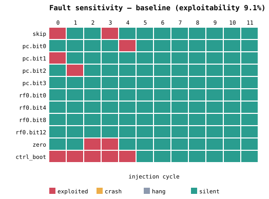
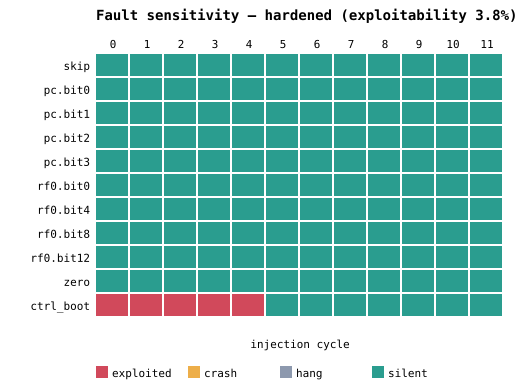

# RTL Fault-Injection Campaign (D1)

A fault-injection framework that red-teams a secure-boot signature check by
forcing signals during RTL simulation, models **instruction skip**, **PC
corruption**, **register bit-flip** and **control-line flip**, classifies every
outcome as silent / crash / hang / **exploited**, and reports the
**exploitability rate before and after hardening**. The delta is the result.

This is the "break it, then harden it" half of a two-repo track; it attacks the
signature-check branch of the sibling
[ibex-secure-boot](../ibex-secure-boot) root of trust.

---

## ⚠️ What IS NOT implemented (read this first)

- **The payload here is a model of the signature-check branch, not the Ibex
  build.** `rtl/secure_check.sv` is a minimal micro-sequenced boot check
  (compare hash → boot or halt) with real control state (IR, PC, register file,
  flags), enough that the four fault types mean what they mean on a core. It is
  **not** the vendored Ibex running D2's ROM code — that integration is the next
  step. Every number below is from this model, and the README says so.
- **Icarus only; not yet ported to Verilator.** The guide's plan is to prototype
  on Icarus (force/release is trivial) and port to Verilator once the sweep is
  large enough to hurt. This sweep is 132 points per variant — small — so the
  port has not been done.
- **The sweep is a curated grid, not exhaustive.** 12 injection targets × 12
  cycles. It is a sensitivity map, not a proof of resistance.
- **No hardware, no synthesis.** This repo is a DV campaign; area/timing of the
  countermeasures belong in the D2 repo once integrated.

## Headline result — measured, committed

Every figure is produced by `make campaign` from `rtl/secure_check.sv` and
written to `results/<variant>/`; the table below is regenerated by the run, not
typed in. See [docs/exploitability.md](docs/exploitability.md).

| variant | points | exploited | silent | exploitability |
|---|---:|---:|---:|---:|
| baseline | 132 | 12 | 120 | **9.1 %** |
| hardened | 132 | 5  | 127 | **3.8 %** |

Hardening eliminates **every** instruction-skip, PC-corruption and zero-flag
exploit. The 5 residual exploits are all a fault forced **directly on the
boot-commit control line** (`ctrl_boot`) — a single node whose corruption boots
by definition. Defending it needs corroborated commit logic, not a compare or a
counter, so it is left as an honest residual rather than driven to a prettier
0 %.




Red = exploited, green = silent (correct refusal), amber = crash, grey = hang.
The instruction-skip row and the zero-flag row go from red to green; the
`ctrl_boot` row stays red in both.

```bash
make all      # build both DUT variants, run the sweep, render the heatmaps
make demo     # one visible bypass: a single instruction skip boots a tampered image
```

---

## The fault model

Faults are SystemVerilog `force`/`release` on the DUT's internal registers
during simulation — the Icarus path the guide names. The important one is
**instruction skip**: force the instruction register to a NOP for one cycle,
exactly what a clock glitch does physically (the fetch does not complete, so the
pipeline executes nothing where an instruction should have been).

| Fault type | Injection | Models |
|---|---|---|
| Instruction skip | force IR → NOP for one cycle | clock glitch, incomplete fetch |
| Register bit flip | force one bit of the register file | EM fault, single-event upset |
| PC corruption | force bits of the program counter | control-flow hijack |
| Control-line flip | force a decoded control line | voltage glitch at decode |

## The campaign

- **Sweep** the cross product (target × cycle); each point is one Icarus run,
  driven from [campaign/run_campaign.py](campaign/run_campaign.py).
- **Classify** every outcome into exactly one bucket
  ([campaign/classify.py](campaign/classify.py)): the image is always tampered,
  so `boot_ok` asserted is always an exploit, never a normal boot.
- **Metric**: exploitability rate = exploited / injected, before and after
  hardening.
- **Artifact**: a fault-sensitivity heatmap
  ([campaign/heatmap.py](campaign/heatmap.py), dependency-free SVG).

## The countermeasures (HARDEN=1)

- **Duplicated compare** with a second encoding — a single skipped instruction
  cannot satisfy both checks.
- **Control-flow-integrity counter** bumped only by real executed instructions
  (not by a NOP/skip), so a skip leaves it short of its expected final value.
- **Redundant refuse** on the failure path — skipping one halt still refuses.
- **Guarded boot gate** — boot commits only if both compares and the CFI counter
  agree.

Then the identical campaign runs again; the before/after delta is the result,
not the countermeasure list on its own.

---

## Repository layout

```
rtl/secure_check.sv     the payload: micro-sequenced secure-boot check, HARDEN 0/1
tb/tb_fault.sv          force/release injection harness, one point per run
campaign/run_campaign.py  sweep driver (one sim per point)
campaign/classify.py      silent / crash / hang / exploited
campaign/heatmap.py       cycle × target → outcome, standalone SVG
results/baseline/       committed pre-hardening sweep output (csv + summary)
results/hardened/       committed post-countermeasure output
docs/                   heatmaps, exploitability table
```

## License

MIT — see [LICENSE](LICENSE).
